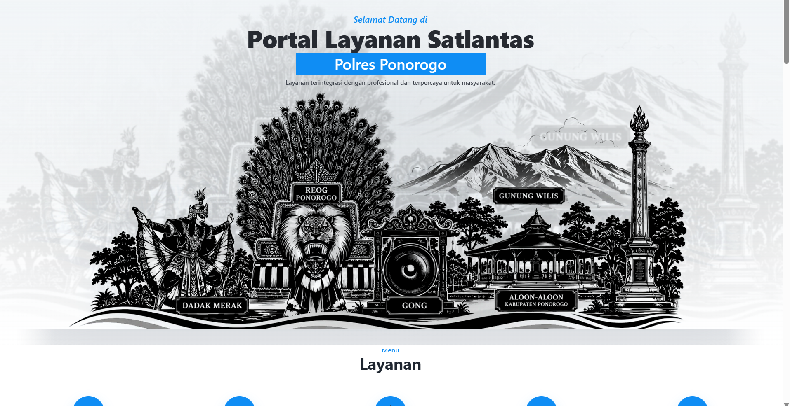

# Satlantas Ponorogo

Open-source WordPress portal for public traffic services and information.

## Overview
## Homepage Preview

Satlantas Ponorogo is a custom WordPress-based public service portal designed to improve access to traffic police services, information, and community engagement.

The project focuses on providing citizens with easy access to:

* Driver License (SIM) Services
* Vehicle Registration (STNK & BPKB) Information
* ETLE (Electronic Traffic Law Enforcement) Information
* Public Complaints
* News and Announcements
* Mobile Driver License Service (SIM Keliling)

## Features

### Current Features

* Custom WordPress Theme
* Responsive Design
* Homepage Service Portal
* SIM Service Information
* STNK & BPKB Service Information
* ETLE Information Page
* Public Complaint Page
* Information & Service Center
* Dynamic SIM Keliling Schedule (Custom Post Type)
* News & Publication Support

### Planned Features

* Dynamic Announcements
* Download Center
* Vehicle Recovery Database
* Public Complaint Management
* WhatsApp Integration
* Service Statistics Dashboard

## Technology Stack

* WordPress
* PHP
* HTML5
* CSS3
* JavaScript

## Project Status

Active Development

## Repository

GitHub Repository:

https://github.com/nurudinrusli2-gif/satlantas-ponorogo

## Maintainer

Primary Maintainer:
Nurudin Rusli

## License

This project is licensed under the GNU General Public License v3.0 (GPL-3.0).

See the LICENSE file for details.
